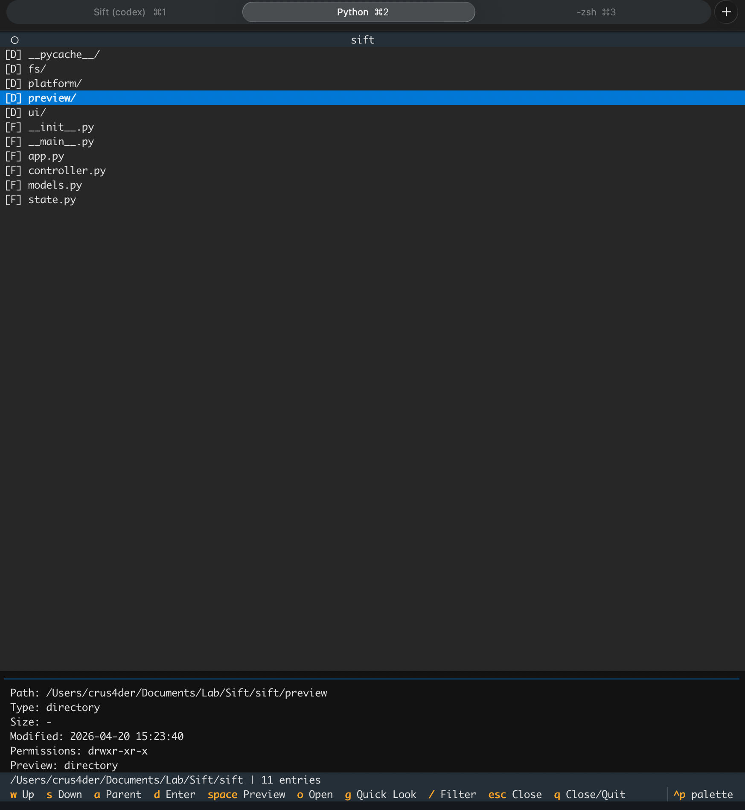
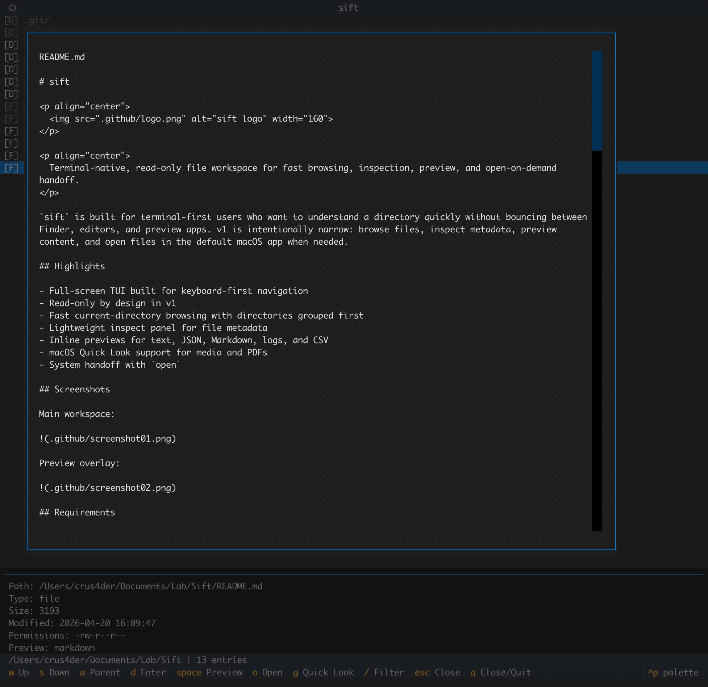

# sift

<p align="center">
  
</p>

<p align="center">
  Terminal-native, read-only file workspace for fast browsing, inspection, preview, and open-on-demand handoff.
</p>

`sift` is built for terminal-first users who want to understand a directory quickly without bouncing between Finder, editors, and preview apps. v1 is intentionally narrow: browse files, inspect metadata, preview content, and open files in the default macOS app when needed.

## Highlights

- Full-screen TUI built for keyboard-first navigation
- Read-only by design in v1
- Fast current-directory browsing with directories grouped first
- Lightweight inspect panel for file metadata
- Inline previews for text, JSON, Markdown, logs, and CSV
- macOS Quick Look support for media and PDFs
- System handoff with `open`

## Screenshots

Main workspace:



Preview overlay:



## Requirements

- macOS
- Python 3.12+
- Terminal with mouse support recommended

## Install

### Global command with `pipx`

If you want `sift` available anywhere on your machine as a single command:

```bash
brew install pipx
pipx ensurepath
git clone <your-repo-url> sift
cd sift
pipx install .
```

Then run:

```bash
sift
sift /path/to/project
sift --help
```

### Local install from source

If you want to install `sift` locally in a virtual environment on this machine:

```bash
git clone <your-repo-url> sift
cd sift
python3 -m venv .venv
source .venv/bin/activate
pip install .
```

Then run:

```bash
sift
sift /path/to/project
```

### Local dev install

If you are developing locally:

```bash
python3 -m venv .venv
source .venv/bin/activate
pip install -e .
```

Then run:

```bash
sift
```

## Quickstart

Launch in the current directory:

```bash
sift
```

Launch in a specific directory:

```bash
sift /path/to/project
```

Show command help:

```bash
sift --help
```

## Controls

- `w` / `s`: move up and down
- `a`: go to parent directory
- `d` or `enter`: enter directory or preview file
- `space`: open preview overlay
- `g`: open Quick Look for supported files
- `o`: open selected file in the default app
- `/`: filter entries in the current directory
- `q`: close preview or quit the app
- `esc`: close preview or clear filter
- mouse:
  click to select
  double-click to enter or open preview
  scroll in lists and preview panes

## Preview Support

Inline preview is available for:

- plain text
- source code
- JSON
- Markdown
- logs
- CSV

Quick Look is used for common macOS-previewable formats such as:

- images
- audio
- video
- PDFs

## Development

Install dependencies:

```bash
pip install -e .
```

Run tests:

```bash
python3 -m unittest discover -s tests
```

Run the app directly from source:

```bash
python3 -m sift
```

## Status

`sift` is currently a focused v1:

- read-only
- macOS-first
- optimized for current-directory navigation rather than recursive indexing

Advanced features like editing, plugins, config systems, and deep search are intentionally out of scope for now.

## Demo

Watch the demo on YouTube:

https://www.youtube.com/watch?v=e6oE2pJe7pQ
